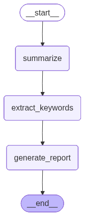

# 예제 21: StateGraph로 첫 번째 워크플로우 만들기

**한 줄 요약:** State · Node · Edge 세 개념으로 구성한 3단계 텍스트 처리 파이프라인.

---

## 배우는 것

- **State (`PipelineState`)**: 모든 노드가 읽고 쓰는 공유 데이터 구조 (TypedDict)
- **Node**: 상태를 입력받아 갱신된 딕셔너리를 반환하는 Python 함수
- **Edge**: `START → summarize → extract_keywords → generate_report → END` 고정 실행 순서
- **`graph.compile()`**: 선언한 그래프를 실행 가능한 앱으로 컴파일하는 방법

---

## 그래프 구조



---

## 실행 방법

```bash
uv run python main.py
```

---

## 예상 출력

```
=== 예제 21: StateGraph 텍스트 파이프라인 ===

그래프 구조 저장 완료: graph.png

[원문]
LangGraph는 LLM 애플리케이션을 상태 기반 그래프로 표현하는 프레임워크다. ...

[요약]
LangGraph는 상태 기반 그래프로 LLM 애플리케이션을 구성하는 프레임워크이다.

[키워드]
['LangGraph', '상태 기반', '워크플로우']

[보고서]
## 분석 보고서
...
```

---

## 환경 변수

| 변수 | 설명 |
|------|------|
| `ANTHROPIC_API_KEY` | Anthropic API 키 (필수) |
