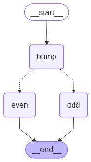

# 예제 22: add_conditional_edges로 조건 분기 라우팅

**한 줄 요약:** 라우팅 함수의 반환값으로 실행 경로를 동적으로 결정하는 조건 엣지.

---

## 배우는 것

- **`add_conditional_edges`**: 라우팅 함수 반환값 → 다음 노드 이름을 매핑하는 방법
- **라우팅 함수**: `Literal` 타입을 반환해 그래프가 선택할 분기를 알려주는 패턴
- **실제 활용**: LLM 출력이나 점수 기반으로 다른 노드·서브그래프로 분기하는 에이전트 패턴의 기초

---

## 그래프 구조



---

## 실행 방법

```bash
uv run python main.py
```

---

## 예상 출력

```
=== 예제 22: 조건 엣지(Conditional Edge) 라우팅 ===

그래프 구조 저장 완료: graph.png

[짝수 분기] n=3 시작 → {'n': 104}
[홀수 분기] n=4 시작 → {'n': -95}
```

흐름 추적:
- `n=3` → bump → 4(짝수) → even(+100) → **104**
- `n=4` → bump → 5(홀수) → odd(-100) → **-95**
