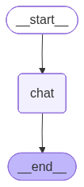

# 예제 41: StateGraph로 가장 단순한 LLM 대화 노드 만들기

**한 줄 요약:** 노드 하나짜리 StateGraph — LangGraph의 최소 구성 단위를 이해한다.

---

## 배우는 것

- **StateGraph 최소 구조**: State · Node · Edge 세 요소로 구성되는 가장 단순한 그래프
- **`add_messages` Reducer**: 상태 필드에 Reducer를 붙이는 방법과 메시지 누적 동작
- **체크포인터 없을 때**: `invoke()` 호출 간 상태가 공유되지 않음 → 매번 새 대화
- **42번과의 차이**: 노드가 1개(chat) vs 3개(summarize·keywords·report)

---

## 그래프 구조



```
START → chat → END
```

---

## 실행 방법

```bash
uv run python main.py
```

---

## 예상 출력

```
=== 예제 41: StateGraph 단일 LLM 대화 노드 ===

그래프 구조 저장 완료: graph.png

──────────────────────────────────────────────────
[질문] LangGraph가 뭐야? 한 문장으로 설명해줘.
[답변] LangGraph는 LLM 애플리케이션을 상태 기반 그래프로 정의하는 프레임워크입니다.
[메시지 수] 2개

[질문] StateGraph는 어디에 쓰여?
[답변] StateGraph는 노드와 엣지로 복잡한 워크플로우를 선언적으로 구성할 때 씁니다.
[메시지 수] 2개

──────────────────────────────────────────────────
```

> 각 질문이 독립 실행 (메시지 수 항상 2개) — 체크포인터를 추가하면 이전 대화를 이어받을 수 있다 → **예제 61** 참고

---

## 환경 변수

| 변수 | 설명 |
|------|------|
| `ANTHROPIC_API_KEY` | Anthropic API 키 (필수) |
