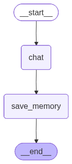

# 예제 62: InMemoryStore로 thread_id를 넘는 장기 메모리 구현하기

**한 줄 요약:** MemorySaver(단기 세션)와 InMemoryStore(장기 사용자 메모리)를 함께 써서 세션이 바뀌어도 사용자 정보를 기억한다.

---

## 61번과의 차이

| | 예제 61 (MemorySaver) | 예제 62 (InMemoryStore) |
|---|---|---|
| 저장 단위 | `thread_id` (세션) | `user_id` (사용자) |
| 세션 종료 후 | 기억 사라짐 | 기억 유지 |
| 용도 | 대화 맥락 유지 | 사용자 프로필·선호도 저장 |

---

## 배우는 것

- **`InMemoryStore`**: `(namespace, key)` 구조로 임의 데이터를 저장·조회하는 장기 메모리
- **`store.put` / `store.search`**: 데이터 저장과 네임스페이스 기반 검색
- **노드에서 store 접근**: 노드 함수 인자에 `store: InMemoryStore`를 선언하면 자동 주입
- **MemorySaver + InMemoryStore 조합**: 단기(세션) + 장기(사용자) 두 레이어 메모리 패턴

---

## 그래프 구조



```
START → chat → save_memory → END
```

---

## 실행 방법

```bash
uv run python main.py
```

---

## 예상 출력

```
=== 예제 62: InMemoryStore 장기 메모리 ===

그래프 구조 저장 완료: graph.png

──────────────────────────────────────────────────
[세션 A] 사용자 정보 입력
──────────────────────────────────────────────────
  [메모리 저장] 로버트, 파이썬 개발자
사용자: 안녕, 나는 로버트야. 파이썬 개발자로 일하고 있어.
AI    : 안녕하세요, 로버트님! 반갑습니다.
        파이썬 개발자로 일하고 계시군요. ...

  [메모리 저장] 취미: 여행
사용자: 취미는 여행이야.
AI    : 오, 여행을 좋아하시는군요! ...

──────────────────────────────────────────────────
[세션 B] 새 세션에서 기억 확인 (thread 달라도 user_id 동일)
──────────────────────────────────────────────────
사용자: 내가 어떤 사람인지 알아?
AI    : 네, 저는 다음과 같은 정보를 알고 있습니다:
        - 이름: 로버트
        - 직업: 파이썬 개발자
        - 취미: 여행

[store 저장된 메모리]
  - 로버트, 파이썬 개발자
  - 취미: 여행
```

> `[메모리 저장]`이 `사용자:` 출력보다 먼저 나오는 이유: `save_memory_node`가 `chat_node` 직후에 실행되기 때문.  
> 세션 B에서 `thread_id`가 달라도 같은 `user_id`로 store를 조회하면 세션 A에서 저장한 정보를 그대로 읽어온다.

---

## 환경 변수

| 변수 | 설명 |
|------|------|
| `ANTHROPIC_API_KEY` | Anthropic API 키 (필수) |
