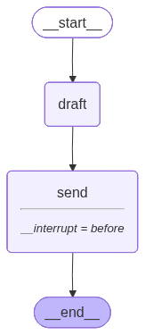

# 예제 71: interrupt_before로 사람 승인 게이트 구현하기

**한 줄 요약:** `interrupt_before`로 위험한 노드 직전에 그래프를 일시 정지하고, 사람이 확인한 후 재개한다.

---

## 배우는 것

- **`interrupt_before`**: `compile()` 옵션 — 지정한 노드 실행 직전에 그래프를 자동 중단
- **`app.invoke(None, config)`**: 중단된 지점에서 재개하는 방법 (체크포인터 필수)
- **`app.get_state(config)`**: 현재 그래프 상태와 다음 실행 노드를 조회
- **왜 필요한가**: 이메일 발송·파일 삭제·결제 등 되돌리기 어려운 작업 전 사람이 개입

---

## 그래프 구조



```
START → draft → ⛔ interrupt → send → END
                     ↑
               사람이 확인 후 invoke(None) 로 재개
```

---

## 실행 방법

```bash
uv run python main.py
```

---

## 예상 출력

```
=== 예제 71: interrupt_before 사람 승인 게이트 ===

그래프 구조 저장 완료: graph.png

──────────────────────────────────────────────────
[실행 1] 이메일 초안 작성 요청
──────────────────────────────────────────────────
[초안 작성 완료]
# 이메일 초안

**제목: 이번 주 업무 완료 보고**

팀장님께,

이번 주 업무 현황을 보고드립니다.

**완료 업무:**
- [구체적인 업무 1] ✓
- [구체적인 업무 2] ✓

...

다음 실행 예정 노드: ('send',)    ← send 직전에서 멈춤
──────────────────────────────────────────────────
초안을 발송하시겠습니까? (y/n): y  ← 사람이 직접 입력
──────────────────────────────────────────────────
[발송 완료] 이메일이 성공적으로 발송되었습니다.
다음 실행 예정 노드: ()            ← 빈 튜플 = 그래프 완료
```

```
# n 입력 시
초안을 발송하시겠습니까? (y/n): n
──────────────────────────────────────────────────
[취소] 발송이 취소되었습니다.
```

---

## 환경 변수

| 변수 | 설명 |
|------|------|
| `ANTHROPIC_API_KEY` | Anthropic API 키 (필수) |
